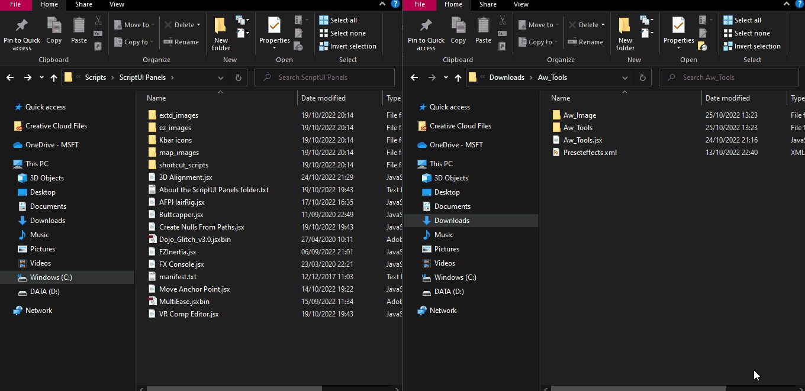

# Aw_Tools 

## # Description

#### Aw_Tools is an After Effects Script that makes it easy for your Motion Graphic needs. The tools contained in this script are :
- Move Anchor Point
- Text Animator
- Expression Runner
- CTI (Current Time Indicator) Mover
- Line Cap/Join Selector

## # Installing
### 1) Copy Pseudoeffect.xml to /Support Files/PresetEffects.xml

- Open the PresetEffects.xml file located in /Your_Version_Adobe/Support File/PresetEffects.xml
- Open the Pseudoeffect.xml file in Zip
- Copy all text in Pseudoeffect.xml
- Paste code below before the last closing </ Effects> tag in the XML File and Save File.

### 2) Copy Aw_Tools.jsx, Aw_Tools Folder, and Aw_Image to Script_UI Panel

- Copy Aw_Tools.jsx, Aw_Tools Folder, and Aw_Image to Script_UI Panel
- Paste To ScriptUI_Panel
- ScriptUI_Panel Location in /Your_Version_Adobe/Support Files/Scripts/

